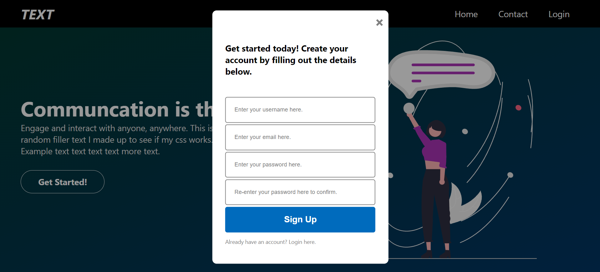
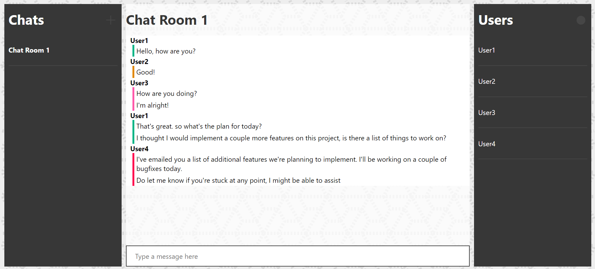
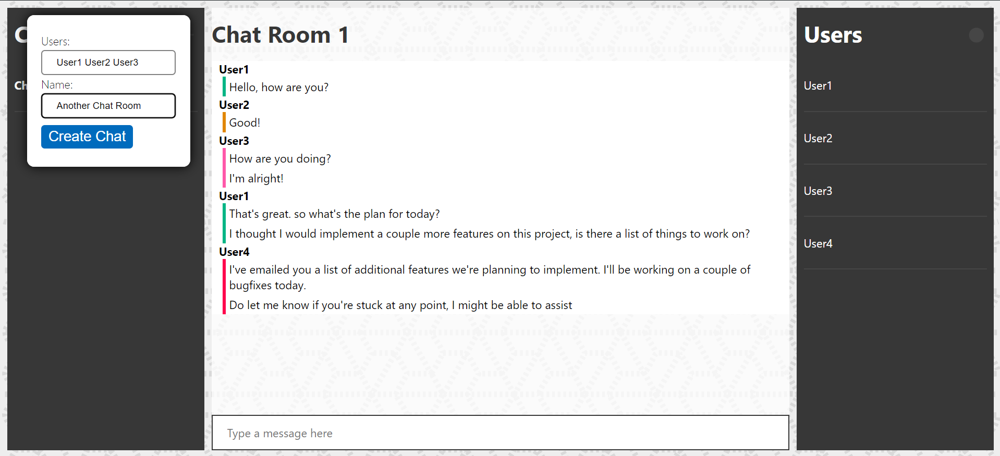
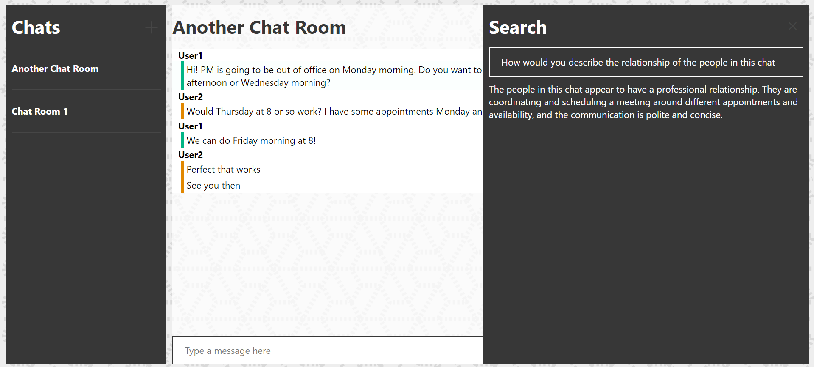
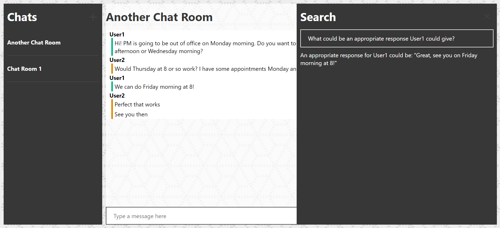

# Chat App

A simple instant messaging platform.

## Table of Contents

- [Introduction](#introduction)
- [Features](#features)
- [Setup](#setup)
- [Usage](#usage)
- [Examples](#examples)

## Introduction

This project is a concept for a simple instant messaging platform built using the MEAN Stack. It integrates the OpenAI API, enabling users to analyze and query chat logs using natural language. This integration allows for seamless searching, summarizing, querying, and analyzing of chat conversations.

## Features

- Modern, responsive user interface
- Secure authentication system using JWTs
- Efficient session management
- Ability to create and invite users to various chat rooms
- Instant switching between chat rooms
- View all participants in a chat room
- Real-time message delivery via WebSockets
- Distinctive colors for each user in a chat room
- Options to delete messages and chat rooms
- Chat logs stored in a vector store for each room
- Natural language querying of chat logs using Langchain and OpenAI completion models, with the vector store serving as context

## Setup

1. Clone the repository:
   ```sh
   git clone https://github.com/simartathgir/Chat-Application.git
   ```
2. Set OpenAI API key:
   ```sh
   vim .env.example # Follow instructions inside the file
   ```
2. Run docker-compose
   ```sh
   docker-compose up
   ```
3. Open localhost on any browser of choice

## Usage

### Creating a user

1. On the welcome page, click "Get Started."
2. Select "sign up here" at the bottom of the popup to create an account.
3. Enter a username, email, password, and password confirmation to sign up.
4. Repeat these steps with different usernames to create multiple accounts.

### Creating a chat room

1. On the home screen, click the "+" button next to the Chat pane.
2. In the popup, enter a list of space-separated valid usernames to include in the chat room.
3. Provide a name for the chat room.
4. Click "Create Chat."

### Messaging

1. Type your message in the chat box and press Enter to send it to the room.
2. To delete a message, hover over it, click the "..." on the right, and select "Delete."
3. To delete a chat room, click the "x" next to the chat's name.

### Searching

1. To search within a chat room, first enter the room.
2. Click the circular button at the top-right corner next to the Users pane.
3. Type your query and wait for the model to analyze and respond (ensure your API key is set in the .env file).

## Examples
1. 
2. 
3. 
4. 
5. 

For more screenshots, look into `/images`
   
